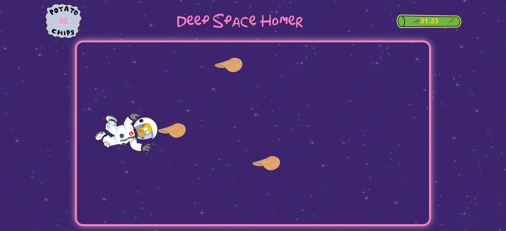

# Deep Space Homer Game

## Descripción
**Deep Space Homer Game** es un juego basado en el icónico episodio de Los Simpson "Deep Space Homer". En este juego, Homer debe atrapar todas las chips que flotan en el espacio mientras evita quedarse sin tiempo.

## Demo
Puedes jugar aquí: [Deep Space Homer Game](https://laiapozo.github.io/deep-space-homer-game/index.html)


## Instrucciones de juego
1. Usa las **flechas arriba y abajo** del teclado para mover a Homer.
2. Atrapa las **chips** que flotan en la pantalla para sumar puntos.
3. Tienes **1 minuto y 45 segundos** para atrapar la mayor cantidad de chips posible.
4. Cuando el tiempo se acabe, el juego terminará.
5. ¡Intenta superar tu puntuación máxima!

## Cómo ejecutar el juego
Si quieres ejecutar el juego localmente:
1. Clona este repositorio:
   ```sh
   git clone https://github.com/laiapozo/deep-space-homer-game.git
   ```
2. Abre el archivo `index.html` en tu navegador.

## Tecnologías utilizadas
- **HTML**: Estructura del juego.
- **CSS**: Estilos y animaciones.
- **JavaScript**: Lógica del juego (movimiento, colisiones, temporizador, puntuación).

## Episodio Original
[](https://www.youtube.com/watch?v=adpUNslsmn4)

## Créditos
- Inspirado en *Los Simpson - Deep Space Homer*.
- Desarrollado por [Laia Pozo Talarn](https://github.com/laiapozo) como parte de un proyecto de aprendizaje y entretenimiento.
- Música: *The Blue Danube Waltz*.
- Imágenes y personajes pertenecen a *Los Simpson*.
